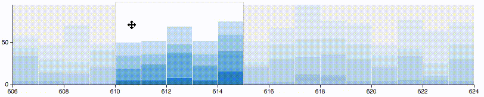

# A selectable stacked bar chart React component

##  About

A [controlled](https://facebook.github.io/react/docs/forms.html) stacked bar
chart React component that allows users to select a range of the stacked
bars. Built using React and D3.js.



This is a pre-release of a package belonging to the Lucify platform. It has been
published to satisfy dependencies of other packages. Any APIs may change without
notice.

## Installation

Add `lucify-bar-chart-range-selector` along with its dependencies (React.js and
D3.js) to your project's dependencies:

```shell
$ npm install react d3 lucify-bar-chart-range-selector --save
```

Require it in your Javascript:

```javascript
var LucifyBarChartRangeSelector = require('lucify-bar-chart-range-selector');
```

Now you can use it like any other React component.

**Note:** this component has only been tested to work with React 0.13. It
should work with React 0.14 as well, but we can't confirm this at this point.

## Props

[TODO: explain these]

- **data**: React.PropTypes.arrayOf(React.PropTypes.object).isRequired,
- **selectedRange**: React.PropTypes.arrayOf(React.PropTypes.number).isRequired,
- **height**: React.PropTypes.number.isRequired,
- **width**: React.PropTypes.number.isRequired,
- **margin**: React.PropTypes.objectOf(React.PropTypes.number).isRequired,
- **customColors**: React.PropTypes.arrayOf(React.PropTypes.array),
- **onChange**: React.PropTypes.func,
- **xTickFormat**: React.PropTypes.func.isRequired,
- **yTickFormat**: React.PropTypes.func.isRequired,
- **xTickValues**: React.PropTypes.array,
- **rangeFormat**: React.PropTypes.func.isRequired,
- **onMouseOver**: React.PropTypes.func,
- **onMouseLeave**: React.PropTypes.func

## Development

Build the Javascript files into `lib/` with:

```shell
$ npm run build
```

Or build the development versions and start the guard with:

```shell
$ npm run dev
```

To serve the example page on port 3000 and see changes live, start Gulp:

```shell
$ gulp
```

Then point your browser to http://localhost:3000/

## Developing as part of a project

To develop this component in tandem with a parent project using `npm link`,
first link this project to the parent project:

```shell
$ cd path_to_this_project
$ npm link
$ cd path_to_parent_project
$ npm link lucify-bar-chart-range-selector
```

Then link the parent project's React folder to this project:

```shell
$ cd path_to_parent_project
$ cd node_modules/react
$ npm link
$ cd path_to_this_project
$ npm link react
```

This is needed in order to prevent React from being loaded twice.
